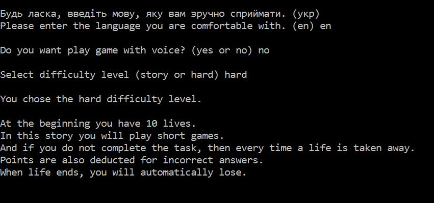
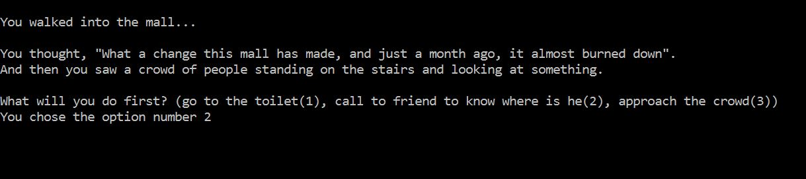
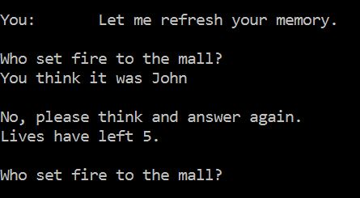

# DETECTIVE_GAME


This **detective game** is about an incredibly interesting murder and how detective Dan Kalini uncovers it all.

**In this game** you will finally feel like a detective. All you need is logical thinking, good attention and a little bit of luck to complete this game.
___
## *Usage*
To begin with you have two option to open this game. 
- First you can open executable file in **detective_game** [archives](https://github.com/Kalinka5/detective_game/tree/main/archives);
- Second you can open any IDE and run *"main"* program in **python_files** [arhives](https://github.com/Kalinka5/detective_game/tree/main/archives).
___

## *Example*
When you open the programme you will choose the language you are comfortable with (*ukrainian* or *english*). Also you can choose play game with audio :sound: or without it :mute:. 



The game also features a choice of actions. Where the character goes or what phrase he says.



There are easy and hard levels. If you chose hard difficalty level you will play short games. Also in this level you will have lives :hearts: and if you lose everything, you will automatically lose.



___

## *Mini_games*
*In detective game you have 3 mini games.*
- "Guess the number"
- "Dice rolling"
- "Rock, paper, scissors"

### __"Guess the number"__
It's first game where you should guess the number which computer was guessed.
Here’s what it looks like:


___

### __"Dice rolling"__
This is second game :game_die: where you must roll the dice and sum of the digits must be greater than or equal to 8. Here’s what it looks like:


___

### __"Rock, paper, scissors"__
And there is last game where you should play famous child game "Rock, paper, scissors". I hope you know rules of this game. Here’s what it looks like:


___

## *PyTorch*

And the trump card in my program is the voices of [Silero models](https://github.com/snakers4/silero-models).

With this module you can set more than 100 votes to the character. 

First of all, import [torch](https://github.com/pytorch/pytorch) and [soundfile](https://pypi.org/project/SoundFile/) in our programm.
```python
import torch
import soundfile as sf
```

Then make configuration of character:
```python
language = 'en'
model_id = 'v3_en'
sample_rate = 48000
speaker = 'en_70'  # en_0, en_1, ..., en_117, random
put_accent = True
put_yo = True
device = torch.device('cpu')  # cpu or gpu


model, _ = torch.hub.load(repo_or_dir='snakers4/silero-models',
                          model='silero_tts',
                          language=language,
                          speaker=model_id)

model.to(device)
```
In conclusion, we convert text to speach and save it in _wav_ format.
```python
def author_speak(what: str, n):
    audio = model.apply_tts(ssml_text=what,
                            speaker=speaker,
                            sample_rate=sample_rate,
                            put_accent=put_accent,
                            put_yo=put_yo)

    sf.write(f'vvauthor_say{n}.wav', audio, sample_rate)
```
___

## *Location*
+ archives
  + detective_game_rar
  + detective_game_zip
  + python_files_rar
  + python_files_zip
+ programme
  + audio
  + audio_ukr
  + characters
  + hard_text
  + hard_text_ua
  + hard_voice
  + hard_voice_ua
  + health_exception
  + main
  + question_text
  + question_text_ua
  + question_voice
  + question_voice_ua
  + story
  + text_game
  + text_game_ua
  + voice_game
  + voice_game_ua
+ text_of_audiofiles
+ text_of_audiofiles_ua